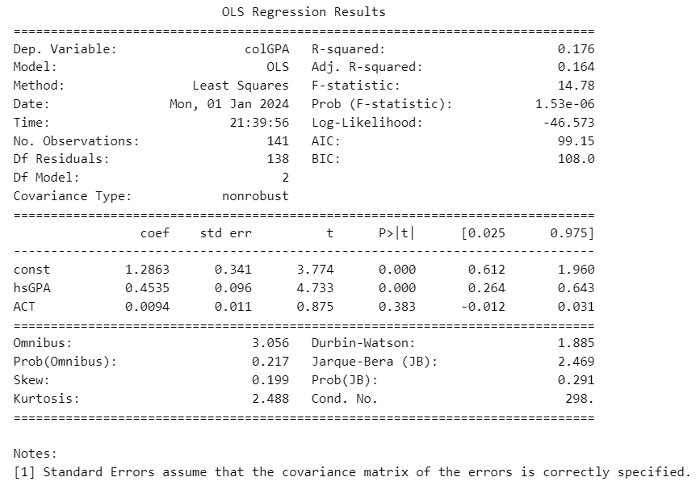

# Implementing OLS
<div style={{ textAlign: 'justify' }}>
Now, let's proceed with the implementation of the Ordinary Least Squares (OLS) method. We'll begin by utilizing Python's built-in package to apply OLS. Following this, we will manually execute the OLS method, employing the formulas and expressions we derived in our earlier notes.

We will be using the **GPA1** dataset from the text book "Introductory Econometrics, A Modern Approach 7e by Wooldridge" for our analysis.
</div>

## Python regression

```python
# importing libraries
import pandas as pd
import wooldridge
import numpy as np
import statsmodels.api as sm

# importing dataset
df = wooldridge.data('GPA1')

# Adding a constant (intercept) term to the independent variable
X = sm.add_constant(df[['hsGPA','ACT']])

# Fit the OLS model
model = sm.OLS(df['colGPA'], X).fit()

# Print the regression results
print(model.summary())
```


The econometric model is
$$
\text{colGPA}_i= \beta_0 + \beta_1\text{hsGPA}_i + \beta_2\text{ACT}_i + \varepsilon_i.
$$

The python regression gives us the following coefficients $(\bold{b})$ and standard errors $(\textbf{S.E})$
$$
\begin{align*}
    \bold{b}=   \begin{bmatrix}
            \hat{\beta}_0\\
            \hat{\beta}_1\\
            \hat{\beta}_2\\
            \end{bmatrix}&=
            \begin{bmatrix}
            1.29\\
            0.45\\
            0.009\\
            \end{bmatrix}\\
    \bold{S.E}&=   \begin{bmatrix}
            0.341\\
            0.096\\
            0.011\\
            \end{bmatrix}\\
\end{align*}
$$

## Manual regression